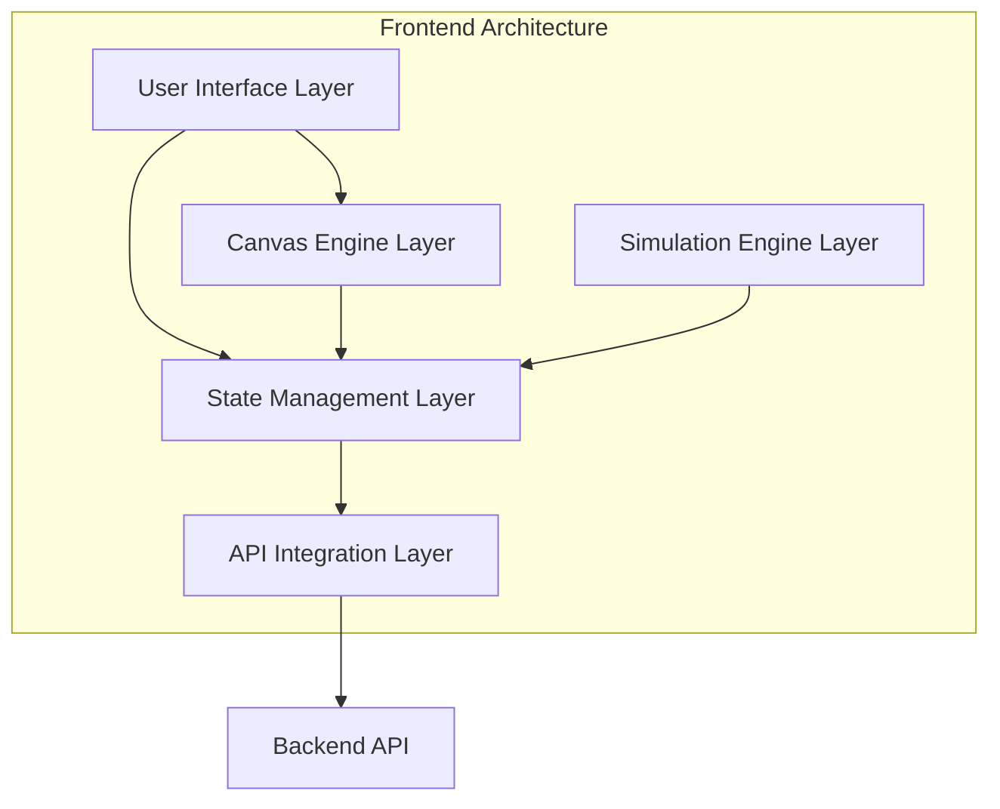
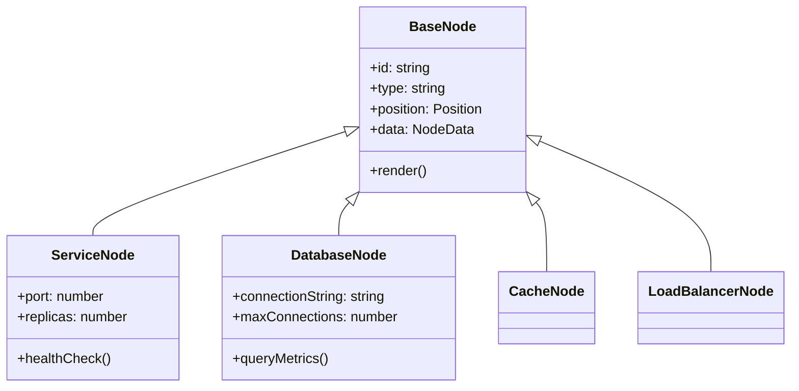
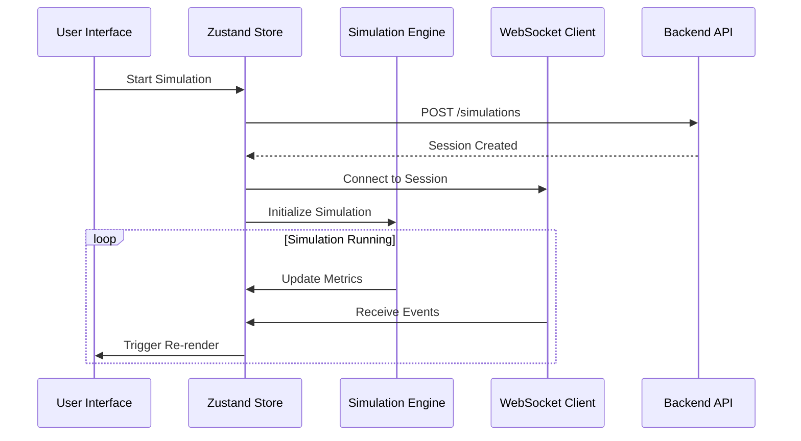

# Architecture Documentation

This document outlines the technical architecture, design patterns, and system structure of the Architech frontend application.

## System Overview

Architech is a web-based system architecture visualization and simulation platform built with modern React technologies. It provides an interactive canvas for designing system architectures and simulating their behavior in real-time.



## Technology Stack

### Core Technologies
- **React 18**: Component-based UI framework with hooks and concurrent features
- **TypeScript**: Static typing for enhanced developer experience and code quality
- **Vite**: Fast build tool and development server
- **Tailwind CSS**: Utility-first CSS framework for styling

### Key Libraries
- **React Flow (@xyflow/react)**: Visual node-based editor for the canvas
- **Zustand**: Lightweight state management solution
- **React Query (@tanstack/react-query)**: Server state management and caching
- **React Router**: Client-side routing
- **Radix UI**: Accessible component primitives

## Project Structure

```
src/
├── components/           # Reusable UI components
│   ├── ui/              # Base UI components (shadcn/ui)
│   ├── nodes/           # Canvas node components
│   ├── edges/           # Canvas edge components
│   └── auth/            # Authentication components
├── features/            # Feature-based modules
│   ├── simulation-canvas/
│   ├── component-palette/
│   └── property-panel/
├── hooks/               # Custom React hooks
├── lib/                 # Utility libraries
│   ├── api/            # API client and types
│   ├── design/         # Design system utilities
│   └── websocket/      # WebSocket client
├── pages/              # Page components
├── stores/             # Zustand stores
└── types/              # TypeScript type definitions
```

## Design Patterns

### Component Architecture

#### 1. Feature-Based Organization
Components are organized by feature rather than type, promoting modularity and maintainability.

```
features/
├── simulation-canvas/
│   ├── components/
│   ├── hooks/
│   ├── types/
│   └── utils/
```

#### 2. Compound Components
Complex UI components use the compound component pattern for flexibility:

```tsx
<PropertyPanel>
  <PropertyPanel.Header title="Component Properties" />
  <PropertyPanel.Content>
    <PropertyPanel.Section title="Configuration">
      <PropertyField name="port" type="number" />
    </PropertyPanel.Section>
  </PropertyPanel.Content>
</PropertyPanel>
```

#### 3. Render Props and Custom Hooks
Business logic is extracted into custom hooks, keeping components focused on presentation:

```tsx
function ComponentCard({ component }) {
  const { dragRef, isDragging } = useDragDrop();
  const { onSelect } = useComponentSelection();
  
  return (
    <Card ref={dragRef} onClick={() => onSelect(component.id)}>
      {/* Component UI */}
    </Card>
  );
}
```

### State Management Patterns

#### 1. Zustand Store Structure
```typescript
interface ArchitectStore {
  // Canvas state
  nodes: Node[];
  edges: Edge[];
  selectedNodeId: string | null;
  
  // Actions
  addNode: (node: Node) => void;
  updateNode: (id: string, updates: Partial<Node>) => void;
  selectNode: (id: string | null) => void;
  
  // Simulation state
  simulation: SimulationState;
  startSimulation: () => void;
  stopSimulation: () => void;
}
```

#### 2. Slice Pattern
Large stores are organized into slices for better maintainability:

```typescript
const createCanvasSlice: StateCreator<ArchitectStore, [], [], CanvasSlice> = (set, get) => ({
  nodes: [],
  edges: [],
  addNode: (node) => set((state) => ({ nodes: [...state.nodes, node] })),
  // ... other canvas actions
});
```

## Canvas System Architecture

### Node System


### Edge System
Edges represent connections between components with different types:
- **HTTP**: REST API connections
- **Database**: Database connections
- **Message Queue**: Async messaging
- **Cache**: Caching layer connections

### Property System
Dynamic property handling based on component types:

```typescript
interface ComponentProperty {
  name: string;
  type: 'string' | 'number' | 'boolean' | 'select';
  default: any;
  validation?: ValidationRule[];
  description?: string;
}

interface ComponentType {
  id: string;
  name: string;
  category: string;
  properties: ComponentProperty[];
  icon: string;
}
```

## Simulation Engine

### Event-Driven Architecture


### Metrics Collection
The simulation engine collects and manages various metrics:

```typescript
interface ComponentMetrics {
  cpu: number;
  memory: number;
  latency: number;
  throughput: number;
  errorRate: number;
  timestamp: Date;
}

interface SimulationEvent {
  id: string;
  componentId: string;
  type: 'request' | 'response' | 'error' | 'warning';
  timestamp: Date;
  data: Record<string, any>;
}
```

## API Integration Layer

### Client Architecture
```typescript
class ApiClient {
  private baseUrl: string;
  private authToken: string | null;
  
  // Authentication methods
  async login(email: string, password: string): Promise<AuthResponse>;
  async register(userData: RegisterData): Promise<AuthResponse>;
  
  // Resource methods
  async getProjects(): Promise<Project[]>;
  async createProject(data: CreateProjectData): Promise<Project>;
  
  // Generic request handler
  private async request<T>(endpoint: string, config: RequestConfig): Promise<T>;
}
```

### Error Handling Strategy
```typescript
interface ApiError {
  code: string;
  message: string;
  details?: Record<string, any>;
}

// Global error handler
const handleApiError = (error: ApiError) => {
  switch (error.code) {
    case 'AUTHENTICATION_REQUIRED':
      redirectToLogin();
      break;
    case 'VALIDATION_ERROR':
      showValidationErrors(error.details);
      break;
    default:
      showGenericError(error.message);
  }
};
```

## Real-time Communication

### WebSocket Integration
```typescript
class WebSocketClient {
  private ws: WebSocket | null = null;
  private reconnectAttempts = 0;
  private maxReconnectAttempts = 5;
  
  connect(url: string, token: string): Promise<void>;
  disconnect(): void;
  subscribe(eventType: string, handler: EventHandler): void;
  send(message: WebSocketMessage): void;
  
  private handleReconnect(): void;
  private handleMessage(event: MessageEvent): void;
}
```

### Event System
Real-time events are handled through a centralized event system:

```typescript
interface WebSocketEvent {
  type: 'simulation_status' | 'component_metrics' | 'component_event';
  data: any;
  timestamp: string;
}

const eventHandlers = {
  simulation_status: (data) => updateSimulationStatus(data),
  component_metrics: (data) => updateComponentMetrics(data),
  component_event: (data) => addSimulationEvent(data),
};
```

## Performance Optimizations

### React Optimizations
1. **Memoization**: Use `React.memo` for expensive components
2. **useMemo/useCallback**: Prevent unnecessary recalculations
3. **Virtualization**: Virtual scrolling for large component lists
4. **Code Splitting**: Lazy loading of feature modules

### Canvas Optimizations
1. **Viewport Culling**: Only render visible nodes and edges
2. **Debounced Updates**: Batch state updates during drag operations
3. **Optimized Re-renders**: Minimize React Flow re-renders

### State Management Optimizations
1. **Selective Subscriptions**: Subscribe to specific store slices
2. **Immer Integration**: Immutable updates with Zustand
3. **Computed Values**: Derive state rather than store duplicates

## Security Considerations

### Authentication Security
- JWT tokens stored securely in memory
- Automatic token refresh
- Secure logout with token cleanup

### API Security
- HTTPS enforcement in production
- Request/response validation
- Rate limiting awareness

### Client-Side Security
- Input sanitization
- XSS prevention
- Secure WebSocket connections

## Testing Strategy

### Unit Testing
- Component testing with React Testing Library
- Hook testing with @testing-library/react-hooks
- Utility function testing with Jest

### Integration Testing
- API client testing with MSW
- Store testing with mock providers
- End-to-end user flows

### Performance Testing
- React Profiler integration
- Bundle size monitoring
- Runtime performance metrics

---

For implementation details and development guidelines, see the [Development Guide](../development/README.md).
